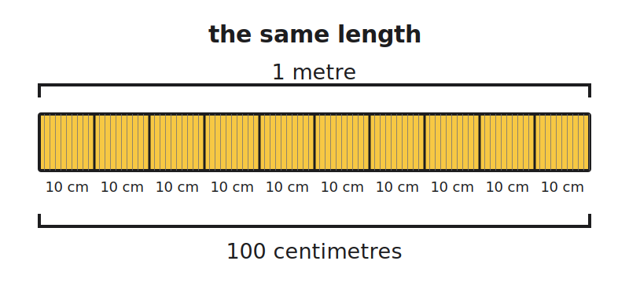
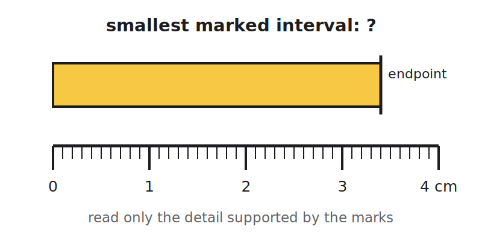
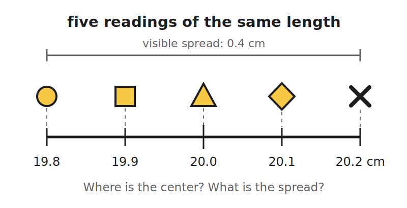
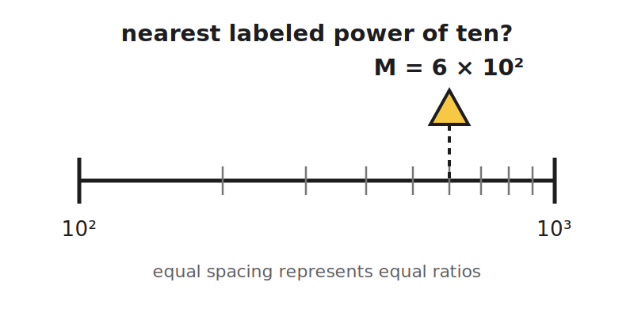

+++
order = 1
subject = "misc"
tags = ["mechanics-revisited", "measurement", "units", "uncertainty", "dimensional-analysis", "estimation"]
+++

# Foundations: measuring before modeling

## 1.1 What mechanics begins with

<!-- card-id: card-eda9021d-1a99-48c6-a746-a7fc07a6fdf1 -->
<!-- card-alias: b9f703c877d10cca1adc65b32dc432371d092183e93d5360b99aad6766550c6c -->
Q: Mechanics begins with two tasks: **describe** what objects do and **explain** why their behavior changes. For a ball that rolls and slows, what belongs to each task?
A: Description records where the ball is and how that changes with time. Explanation builds and tests an account of which interactions produced the change. This chapter first builds the measurement tools needed to make descriptions testable.

<!-- card-id: card-9b472b70-65cc-4784-97bc-fbf8d2e9f5cf -->
<!-- card-alias: 4cce4a95ab6e0c6daafff496684048414581a4246bfb4abc1c1e8f93086501e1 -->
Q: A cup is on a table. “The cup's center is 12 cm from the table edge” is an observation; “someone pushed it there” is an explanation. Why must mechanics keep those two statements distinct?
A: The position can be checked by measurement, while the proposed cause requires additional evidence. Separating what was observed from the model used to explain it prevents an assumption from being mistaken for data.

<!-- card-id: card-9a8efddb-ed3c-493f-877e-a3f0a6e284e7 -->
<!-- card-alias: 45e3b5b69cacfe1d64d24a0c820f3c797f962d8b2054ad26cdc3480fa35be359 -->
Q: Which question is ready for quantitative investigation: “Is this book heavy?” or “What number and unit does the scale report for this book?” Why?
A: “What number and unit does the scale report?” It names a procedure that produces a reproducible measurement. “Heavy” is comparative and needs an agreed reference before different observers can test the same claim.

## 1.2 Quantities and units

<!-- card-id: card-440e134b-8098-4e44-b04c-5725f9fa1c7d -->
<!-- card-alias: 4a625071cb622ca84d104680b1c6aa12817d521b795dac91e4d4d952f59b8b77 -->
Q: A **physical quantity** is a measurable property. In the report “the board's length is 1.20 metres,” identify the quantity, numerical value, and unit.
A: Quantity: **length**. Numerical value: **1.20**. Unit: **metre (m)**.

<!-- card-id: card-a2c3d8b5-6a83-4adc-b8a9-d15a1e5d96ef -->
<!-- card-alias: 7ab262043ea9704374588559a6eb32737ec6ebaabb13df9be7430b9e536a3b97 -->
Q: A unit is an agreed reference used for comparison. What information does the unit add to the bare statement “the board's length is 1.20”?
A: It identifies the size of the reference being counted. “1.20 m” means 1.20 times the agreed metre; without a unit, the number does not specify a length.

<!-- card-id: card-b3609e1d-5cf4-46d2-9350-286e852ac967 -->
<!-- card-alias: 893749d217d6330fef96a5344aeee33588137799c341d18e97565b9e10760967 -->
<!-- card-alias: 4221d3dc7a61d886b4ad8f014009b18a90af82b96362a7f88939e77a7fa90a36 -->
C: A measured value is reported as a [number] multiplied by a [unit].

<!-- card-id: card-9ec6cffd-9bcc-423d-8015-d31845bde97a -->
<!-- card-alias: dfc45c472d3c199197171661ad6b6b801b17cf84fe87c9d6530eba723569d07c -->
Q: Why use standardized units instead of a person's handspan or stride?
A: Personal references vary. A standardized unit lets different people reproduce, compare, and communicate measurements without sharing the same body or instrument.

<!-- card-id: card-241440f8-d9c7-4686-9e55-ea6328f4703c -->
<!-- card-alias: fd415b97207e5aa1ee5b8bb3f5c3e0dfa5533fccc29cc9fb9e117b8d759d6c04 -->
Q: The **International System of Units**, abbreviated SI, is the shared measurement system used in science. What problem does SI solve?
A: It gives measurements a common language: agreed unit definitions and symbols make results comparable across people, instruments, places, and times.

<!-- card-id: card-ee51d60d-30ef-4f53-b5c2-d47e806e5bf3 -->
<!-- card-alias: 3f34d6f115db2b9357474710c0f083469aaefe900689c7fd5c5ab7fceda0a2a4 -->
Q: SI pairs length with the metre (m), mass with the kilogram (kg), and time with the second (s). If you record how long an event lasts, which quantity and SI unit should you report?
A: Report the quantity **time** in **seconds (s)**. The front also establishes the other two foundational pairings for later retrieval.

<!-- card-id: card-f43ccb02-a961-4a6e-853d-b54bf8ada33f -->
<!-- card-alias: 827869c9b4ac0b2e41bcfca25455e7b2ffb254720efee797456990ed7aa84de3 -->
C: The SI unit paired with length is the [metre (m)].

<!-- card-id: card-477b503e-10ef-4b27-88d5-c463df94a4d3 -->
<!-- card-alias: cc366a173b8ff0af5ec1f2423c92184c78670477aec2b4cd36c6308a23e29eab -->
C: The SI unit paired with mass is the [kilogram (kg)].

<!-- card-id: card-f62c32e5-1955-4dd4-b088-66d6f4342ec5 -->
<!-- card-alias: dde175d28ecadf0d6357647671ed9b60a30acdf089f3b94534a2780eb4eb7816 -->
C: The SI unit paired with time is the [second (s)].

<!-- card-id: card-8b4f87ae-944c-4081-bab0-ccff60c2a652 -->
<!-- card-alias: b9e79dedc120b7188a809920e4f3f7852953eb3e15002678dd68f7b97c431ced -->
Q: A **dimension** names the kind of quantity, while a **unit** specifies an agreed reference size. For a table length reported as 1.20 m, what is the dimension and what is the unit?
A: Dimension: **length**, conventionally written L. Unit: **metre**, written m. The same dimension could instead be reported in centimetres or kilometres.

<!-- card-id: card-155043ca-2f55-40cb-a7a8-83000b4c94f2 -->
<!-- card-alias: 9a18deb19df1d042c61e6d9079c3699c93d754895de37a84d9b6410aa3de8021 -->
Q: Can two measurements have different units but the same dimension? Give an example.
A: Yes. 2 metres and 200 centimetres use different units but both have the dimension length and describe the same length.

<!-- card-id: card-7459f068-7ffb-4067-80dc-dc77a23d2ad6 -->
<!-- card-alias: 95fdf70198236e836569abe77ad8e28efced50c7481a958cab51d30dd9cf2a6f -->
Q: An area is made by multiplying one length by another. Why is square metre, $\text{m}^2$, called a **derived unit** rather than a base unit?
A: It is built by combining the base unit metre through multiplication: $\text{m}\times\text{m}=\text{m}^2$. Its dimension is likewise derived as $\text{L}^2$.

## 1.3 Prefixes and conversion

<!-- card-id: card-68e1de9c-4f6d-482b-a59c-9831f11e2dc4 -->
<!-- card-alias: b331c923062b9d70b3708bc11fe670525f00d0fc2cdeb3db24c113397837d70c -->
Q: An SI prefix scales a unit by a power of ten. What do **centi-** and **kilo-** mean in $1\,\text{cm}=10^{-2}\,\text{m}$ and $1\,\text{km}=10^3\,\text{m}$?
A: **Centi-** means one hundredth ($10^{-2}$); **kilo-** means one thousand ($10^3$).

<!-- card-id: card-6ec56723-19a3-41d1-ac34-93a2c487e342 -->
<!-- card-alias: 5f5361094e8ff2ede8b56698a1f128b00752a43e6c7b268fb4af6a708f36738e -->
Q: The bar shows one metre divided into 100 equal centimetres. What does it reveal about the numerical value used to describe the same length in smaller units?

A: The numerical value becomes larger: the same length is $1\,\text{m}$ or $100\,\text{cm}$. A smaller unit must be counted more times.

<!-- card-id: card-c22c32f5-fc12-4e9c-b286-2abc2973de48 -->
<!-- card-alias: 5d93f73b216dafce9937f121e475d99853303019cfe90d9e32c55edd0a8e4062 -->
Q: A conversion factor is a ratio of two equal lengths, such as $\frac{1\,\text{m}}{100\,\text{cm}}$. Why does multiplying by it change the unit but not the physical length?
A: The numerator and denominator describe the same length, so the ratio equals 1. Multiplying by 1 changes the written representation, not the quantity itself.

<!-- card-id: card-1cfe22ed-2225-4885-958c-dcab92ce8805 -->
<!-- card-alias: e4f8cdca9065748c8fc24f55cd62e9fba22c04bc6ec7e5810f68af775428bd42 -->
<!-- card-alias: c3b730426a41a784e1c30fcd89b68c13485d0ce612070bc95e0ba340e6a550ed -->
C: A valid unit-conversion factor is a ratio of two [equal quantities], so its value is [1].

<!-- card-id: card-2aba6313-d76d-4344-a685-855891ad8de5 -->
<!-- card-alias: 404b9d745b0e41236913b00edfa55448c21bcd053900bf8ac24c413c4ff5032b -->
P: Convert $250\,\text{cm}$ to metres by choosing a conversion factor that cancels centimetres.
S:
**IDENTIFY**: We need the same length expressed in metres, and $100\,\text{cm}=1\,\text{m}$.

**PLAN**: Put centimetres in the denominator so the original unit cancels.

**EXECUTE**:
$$250\,\text{cm}\times\frac{1\,\text{m}}{100\,\text{cm}}=2.50\,\text{m}.$$

**EVALUATE**: Metres are larger than centimetres, so the numerical value should decrease. $2.50\,\text{m}=250\,\text{cm}$, so the scale and units agree.

<!-- card-id: card-b2078fb5-186d-4eec-bbfd-f0b10eca979a -->
<!-- card-alias: 7c973aa6e616db9ae6f24aeccb5a669380a78a8d15dd857760d70ab2f1fc12c4 -->
Q: What quick unit check catches a conversion factor that has been placed upside down?
A: Write the units through the calculation and verify that the unwanted unit cancels while the desired unit remains. Also check scale: converting to a larger unit should usually produce a smaller numerical value.

## 1.4 Resolution, repeated readings, and uncertainty

<!-- card-id: card-6b8f8093-3fa6-40ba-83c1-3f6ec8744fdb -->
<!-- card-alias: 19e1c17294f49c9b3462e525ddb1b5e79e77132fefdf51f442f880fb3fc7afd0 -->
Q: An instrument's **resolution** is the smallest change its display or marked scale can distinguish. On the ruler below, what is the smallest marked interval, and what length is directly supported for the yellow bar?

A: The smallest marked interval is $0.1\,\text{cm}$, and the bar ends at $3.4\,\text{cm}$. Reporting many extra decimal places would claim detail that this scale does not display.

<!-- card-id: card-8ad61738-2a4c-4cb9-b146-e720b2aa1a75 -->
<!-- card-alias: 71ed8eac6dd1c28ccf7d9debb524b45df61f7f79aa825ca654a4ce2aa213e387 -->
Q: Why does writing $3.400000\,\text{cm}$ for that ruler reading not make the measurement more informative?
A: Extra written zeros cannot create instrument resolution. They imply that changes far smaller than $0.1\,\text{cm}$ were distinguished even though the scale provides no such evidence.

<!-- card-id: card-1035b55d-ac2a-494f-a9be-77c7120ffef8 -->
<!-- card-alias: 302f2596931f9c6272aba167d7e9f0ee77b9b39f92c7276bee589b6d924dfa4a -->
Q: Five repeated length readings are plotted below. What central value and spread are reasonable summaries of what the plot shows?

A: A central value of about $20.0\,\text{cm}$ and a visible half-range of about $0.2\,\text{cm}$. The repeats show small scatter; a formal uncertainty would depend on the instrument and analysis method.

<!-- card-id: card-d3ecb0ca-43cf-4d49-8389-00ba9a4c7f9b -->
<!-- card-alias: 3611505e9987dd89ca483ad4fa9e4da8d616509ca781cb71d9eafd2fbc0ed0b7 -->
Q: Why repeat a measurement instead of trusting one reading?
A: Repeats reveal variation that one reading hides. They help estimate a representative value, expose random scatter, and can reveal blunders or changing conditions.

<!-- card-id: card-a07c6821-8f7d-49c4-ae5f-13c6510e6227 -->
<!-- card-alias: 480eb4908bfb3770da5a00dd3207c78b25f77d594153bf40f07eb04e215dab43 -->
Q: **Precision** concerns how closely repeated readings cluster; **accuracy** concerns closeness to the accepted or true value. Can a set of readings be precise but inaccurate?
A: Yes. A miscalibrated instrument can give tightly clustered readings that are all shifted from the accepted value. Small scatter does not guarantee small bias.

<!-- card-id: card-bed66ffb-6d02-40ac-b68c-10e146631819 -->
<!-- card-alias: 6c4ca300bcc4dba673ee1248748db4d8f8efcebd5456521092027eb273c7c2ad -->
Q: Two scales repeatedly measure a $100.0\,\text{g}$ reference. Scale A reads 99.9, 100.0, and 100.1 g; Scale B reads 103.0, 103.0, and 103.1 g. Which is more accurate, and which readings are comparably precise?
A: Scale A is more accurate because its readings lie near $100.0\,\text{g}$. Both sets are comparably precise because each has little spread, but Scale B appears biased high.

<!-- card-id: card-b9960be1-5922-453b-8bb2-b2e8fd190047 -->
<!-- card-alias: 411a524af2ad4fd60f60c9f853755f7247c18d66ace29ea608d5ea844dd4ea9d -->
Q: A result written $(20.0\pm0.2)\,\text{cm}$ communicates an interval as well as a central value. In plain language, what does it say?
A: The reported best value is $20.0\,\text{cm}$ and the stated uncertainty is $0.2\,\text{cm}$. Under the chosen uncertainty convention, values roughly from $19.8$ to $20.2\,\text{cm}$ are compatible with the result.

<!-- card-id: card-860f964e-fc2a-4bf9-8305-22f2599cf425 -->
<!-- card-alias: 740371fe46a4f676ee94d8b52e44c0dc6412cec8c4b887c3b3e5cd41380cdc9c -->
Q: What should the last reported digits of a measured result communicate?
A: Only detail justified by the measurement and its uncertainty. Digits far beyond the uncertain place create false precision; rounding away supported digits discards information.

<!-- card-id: card-23f385cc-0499-4eda-9129-419b2c1c99b4 -->
<!-- card-alias: 4a51532049b0afbf9cea030387633f41564feabd85d26a4b48033620a464e33d -->
Q: Why should intermediate calculator values usually remain unrounded until the final result?
A: Repeated early rounding can accumulate avoidable numerical error. Keep extra working digits, then round the final value to a precision justified by the input measurements or stated uncertainty.

## 1.5 Dimensions as a type-check

<!-- card-id: card-b04eda69-a2ea-4b08-9dce-c513831fc51f -->
<!-- card-alias: df5add2f98a9643735f5537e51e2f84c017d913a92dac132294115d961c7e5a8 -->
Q: In dimensional notation, mass, length, and time are written M, L, and T. What are the dimensions of a mass measurement, a length measurement, and an area made from two lengths?
A: Mass: M. Length: L. Area: $\text{L}^2$ because $\text{L}\times\text{L}=\text{L}^2$.

<!-- card-id: card-a0449e79-290c-4c06-acbf-f00ff3e012fa -->
<!-- card-alias: 88569b33972b5d5527895e4d0e2af96db6343bff8332e2713282d7b83741a8ff -->
Q: A proposed equation can equate or add quantities only when their dimensions match. Why is this rule like a type-check?
A: Dimensions identify the kind of quantity. Just as a program should not add incompatible data types, a physical equation cannot meaningfully add a length to an area or set a mass equal to a time.

<!-- card-id: card-05ee6ca0-5079-4ee0-94ae-104ecf9a2765 -->
<!-- card-alias: f17c33aaef2be9aa00527f10df7afaa8c1c39dc13c4ee4e8ed90366f49a0ed30 -->
C: In a dimensionally consistent equation, every term that is added and both sides of the equality must have the [same dimensions].

<!-- card-id: card-32dea367-61d3-418c-bb75-2e8847f2b72d -->
<!-- card-alias: 980a0a44325b10a0e865af22db06064182a1eed3008e76d8a019507e97e8135b -->
P: A rectangle has side lengths $a$ and $b$. Which proposed expression could represent its area: $A=a+b$ or $A=ab$? Use dimensions, not a memorized area formula.
S:
**IDENTIFY**: Area has dimension $\text{L}^2$, while both $a$ and $b$ have dimension L.

**PLAN**: Compare the dimension of each right-hand side with $[A]=\text{L}^2$.

**EXECUTE**:
- $[a+b]=\text{L}$ because both added terms are lengths.
- $[ab]=\text{L}\cdot\text{L}=\text{L}^2$.

Therefore only $A=ab$ passes the dimensional check.

**EVALUATE**: Passing this check makes $ab$ dimensionally possible. The check alone would not rule out a dimensionless factor such as $2ab$; geometry supplies the exact relation.

<!-- card-id: card-89ad77e7-f6e6-4a28-b9ea-ce8a7b910127 -->
<!-- card-alias: 516e3da3f7860d5fd6194dcd08b1bf2f06eff77a640f3e887d12c047aab4a81c -->
Q: If an equation is dimensionally consistent, has dimensional analysis proved it correct?
A: No. Consistency is necessary but not sufficient. A wrong numerical factor, sign, dependence on a dimensionless quantity, or incorrect physical model can still pass the dimensional check.

## 1.6 Scale and estimation

<!-- card-id: card-cb193413-e1fd-4298-8ab8-56f7c1ce7a2b -->
<!-- card-alias: 002007b5e006a0a53d817ca9f0a8a06032cfd9e2e9a71c3f098f5408ce0bf158 -->
Q: An **order of magnitude** describes scale using a nearby power of ten. What does saying a quantity has order of magnitude $10^3$ communicate?
A: Its scale is thousands rather than tens, millions, or another widely separated scale. It is an approximate classification, not a claim that the value equals exactly 1000.

<!-- card-id: card-0de5dd54-d6d5-4389-833d-a0efbfda8387 -->
<!-- card-alias: 08b286db92cd418eaca1b9643e0a34e2e4b2609b7d64ca031eee95ab05ad8ffa -->
Q: Point $M$ marks $6\times10^2$ on the logarithmic scale. Which labeled power of ten is nearest to it?

A: $10^3$. On a logarithmic scale the halfway boundary is the geometric mean, $\sqrt{10^2\cdot10^3}\approx3.16\times10^2$, and $6\times10^2$ lies above it.

<!-- card-id: card-e859bf7f-da4b-4a5c-a85a-69a028f1b8fd -->
<!-- card-alias: b9c5927b7d15997ff6b74a74c6dc22bffbaa500c7f11d5bb0e4b0b795e0e5369 -->
Q: Why estimate the scale of an answer before or after doing detailed arithmetic?
A: A rough scale provides an independent check. If the detailed result differs by many powers of ten, the setup, units, or calculator entry probably needs inspection.

<!-- card-id: card-02c56eab-514e-48be-b8d3-a8584e039e29 -->
<!-- card-alias: 4f1bdfc1ae6f016329fafda83b100973cad8dd2f7922a36ebe6318c92cac6307 -->
Q: A **Fermi estimate** breaks a hard-to-measure total into simpler factors that can be estimated. Why can this be useful even when none of the factors is exact?
A: Combining reasonable approximate factors can locate the total's scale, reveal which assumptions matter most, and provide a check on a later detailed calculation.

<!-- card-id: card-41ea5142-ecc0-4531-a583-cbfdefc0f6db -->
<!-- card-alias: b4885a1617c94c413616b98c9a0fcbf4bc6366840396aba4ee9d75af31bf44d9 -->
P: Estimate the number of heartbeats a person has in one year using $70$ beats per minute. State the factors, calculate, and report an appropriate order of magnitude.
S:
**IDENTIFY**: Total beats equal beats per minute times minutes per hour, hours per day, and days per year.

**PLAN**: Use $70\,\text{beats/min}$, $60\,\text{min/h}$, $24\,\text{h/day}$, and about $365\,\text{day/year}$.

**EXECUTE**:
$$70\times60\times24\times365\approx3.7\times10^7\ \text{beats/year}.$$

**EVALUATE**: The order of magnitude is $10^7$ beats per year. The estimate varies with heart rate, but it robustly places the result in the tens of millions rather than thousands or billions.

<!-- card-id: card-0cad5458-567c-4eae-804b-d356fcd7ca44 -->
<!-- card-alias: ba2b142b3455582d395992ae84ffede6235ee72b2a741b7713b96945f20460af -->
Q: Before accepting a numerical mechanics result, which three checks from this chapter should become habitual?
A: Check **units/dimensions**, check **scale** with an estimate, and check that the **reported precision** is justified by the information provided.
