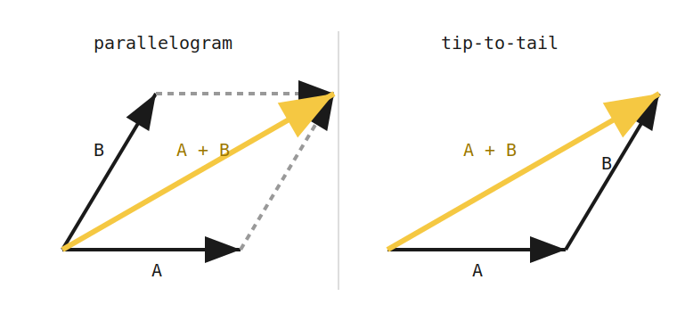
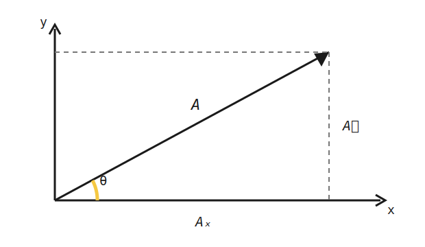
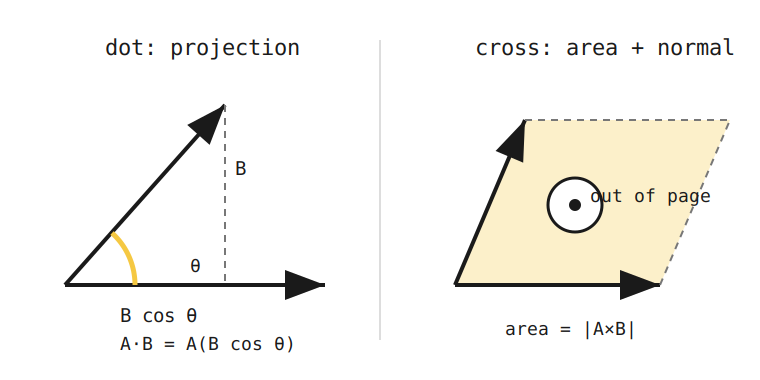
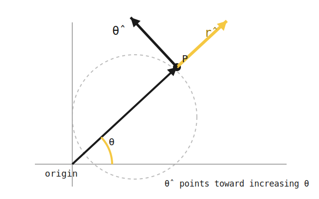

+++
order = 2
subject = "misc"
tags = ["mechanics-revisited", "vectors", "math", "dot-product", "cross-product"]
+++

<!-- Comparison snapshot copied from physics/mechanics before fresh chapter-2 regeneration on 2026-07-15. -->

# Classical Mechanics — Vectors

## 2.1 Scalars vs Vectors

<!-- card-id: card-e0ef7690-10ac-4adb-83ae-5d2391578370 -->
<!-- card-alias: 35a96f894cd86884619822567b253314a15f940c139411a644decebec6f79aaf -->
Q: Why do physicists distinguish scalars from vectors?
A: Many physical quantities (force, velocity, displacement) have a direction that affects how they combine. Treating them as pure numbers would give wrong results; the direction must be tracked explicitly.

<!-- card-id: card-ff55ef18-6470-4d45-be5f-78c9ad29a1fb -->
<!-- card-alias: ada868ea9d52b95c7c29231ef6fdc705701e1b8317b057e6e5ad1cd6abb6e8bd -->
Q: What is a scalar quantity?
A: A quantity fully described by a magnitude alone, with no direction. Examples: mass, temperature, speed, energy.

<!-- card-id: card-e1fa128a-2367-4063-9ff4-db2222c66a78 -->
<!-- card-alias: f190b63b914b26977d948f835bd97726dd1f67e6cef4f7c784f9128f94865be8 -->
Q: What is a vector quantity?
A: A quantity that has both magnitude and direction. Examples: velocity, force, displacement, acceleration.

<!-- card-id: card-eee2e854-57c6-43f1-a80d-a51662be501c -->
<!-- card-alias: 38d0fdacca3e6cc561bce62222dc91dbab56c68748b700b3e92b03bf3850ff12 -->
<!-- card-alias: 87f6541e5c09b7bc2208f900eb415ad381a842a53ecf0bd81a4ae813307b3d91 -->
C: A scalar has [magnitude only], while a vector has both magnitude and [direction].

<!-- card-id: card-898310c2-b3b4-4a18-a543-78b5c96a6b48 -->
<!-- card-alias: f4efd1ffd2dd6764eb5fe94dc7970689692db419882a9e0858b89de0bbdfda80 -->
Q: What is the parallelogram rule for vector addition?
A: Place the two vectors tail-to-tail. The diagonal of the parallelogram formed by the two vectors is their vector sum.

<!-- card-id: card-5ee5f22e-74f5-43b3-aa96-8cc69b470ae5 -->
<!-- card-alias: b87c4427e444611d051ad71d150141101ab7c8133bd87d0e6af08b703406c86e -->
C: An arrow such as $\vec{v}$ denotes a vector; a hat such as $\hat{v}$ specifically denotes a [unit vector] of magnitude 1.

## 2.2 Cartesian Components

<!-- card-id: card-89312aed-11c7-4efb-b6f4-d4c22a9f21df -->
<!-- card-alias: b87dd9e61e7dab3a71385526799bb8ad9fb8077fa57b9c2ac45d6ccd1d74a6ee -->
Q: Why decompose a vector into Cartesian components?
A: Component form replaces geometric constructions with algebra, making calculations systematic and exact regardless of the angle.

<!-- card-id: card-ba617fc6-aa5d-47fd-98bb-d4e5ff44bee4 -->
<!-- card-alias: 74ca3576b1e9b31074dbadf318243a8c28e06ae562bee1c80cefc715409dd630 -->
C: A vector in 3D is written $\vec{A} = A_x\hat{i} + A_y\hat{j} + A_z\hat{k}$, where $\hat{i}, \hat{j}, \hat{k}$ are [unit vectors] along the $x$, $y$, and $z$ axes.

<!-- card-id: card-0e967b74-10bd-4b54-bb47-357a14b38287 -->
<!-- card-alias: b8fb76d8abb4c670f48988ca57fdce36fae5c17b7d3716d281358ede7bdfce38 -->
C: For a vector at angle $\theta$ from the $x$-axis, the $x$-component is $A_x = [A\cos\theta]$, where $A$ is the magnitude.

<!-- card-id: card-01e8e51f-847e-4a2a-a9be-94b2dea0014f -->
<!-- card-alias: d5ba2057158cfb0c8ff0c06b8e5a7f5c2193d7aee399bf25f7f97bb38f1eafe1 -->
C: For a vector at angle $\theta$ from the $x$-axis, the $y$-component is $A_y = [A\sin\theta]$, where $A$ is the magnitude.

<!-- card-id: card-8e4dc242-fd8c-4b25-b0ed-20e72d10a4a1 -->
<!-- card-alias: 6bcc7a7bcfba3411b352103a587a75d101121dd165e93129524b7c06171866e4 -->
C: The magnitude of a 2D vector with components $A_x$ and $A_y$ is $A = [\sqrt{A_x^2 + A_y^2}]$.

<!-- card-id: card-43659df5-dc31-47c5-94d0-e66d2957189a -->
<!-- card-alias: b007c1dd8af61dc3b7e207a31cbbc14256cba96591c11546f638481dbfebea5b -->
Q: How do you find the angle $\theta$ a 2D vector makes with the positive $x$-axis without losing quadrant information?
A: Use $\theta = \operatorname{atan2}(A_y,A_x)$. A one-argument $\arctan(A_y/A_x)$ is ambiguous by $180°$ and fails when $A_x=0$.

## 2.3 Vector Addition

<!-- card-id: card-5ce77934-0f43-4f5b-9735-cf4a5f9daa9d -->
<!-- card-alias: cee4414eea076e5ad609b22c843c06848ae34a3f7d892635ad7ab8b3d29381c9 -->
Q: Why is the component method more reliable than the graphical (tip-to-tail) method for vector addition?
A: Graphical methods depend on accurate drawing and measurement, introducing geometric errors. Component addition is exact arithmetic.

<!-- card-id: card-e0cd2f83-d0b7-46de-999a-11dfc47a0ae5 -->
<!-- card-alias: 8fa264e9a383b8150668a1ee6659d20baae322d658c8cd6acbf5e86fabda73a3 -->
Q: How do you add two vectors $\vec{A}$ and $\vec{B}$ using components?
A: Add corresponding components: $\vec{A} + \vec{B} = (A_x + B_x)\hat{i} + (A_y + B_y)\hat{j} + (A_z + B_z)\hat{k}$.

<!-- card-id: card-0f5c2074-1c6d-48e3-9e91-a6a5741d1df9 -->
<!-- card-alias: 6a89265b931d3968f25b351711f2b1eea3cb15660e218eb09d31b60d5889d5d1 -->
Q: What is the tip-to-tail (triangle) method for vector addition?
A: Place the tail of $\vec{B}$ at the tip of $\vec{A}$. The vector from the tail of $\vec{A}$ to the tip of $\vec{B}$ is $\vec{A} + \vec{B}$.

<!-- card-id: card-551e837a-dd55-466a-bd73-528615538835 -->
<!-- card-alias: 2fe24e2b031e981379f69c3741b7db4df904935590f45783a207e2e82f44d3e9 -->
C: Vector subtraction is defined as adding the [negative] of the second vector: $\vec{A} - \vec{B} = \vec{A} + (-\vec{B})$.

## 2.4 Scalar (Dot) Product

<!-- card-id: card-8b2a6257-bc02-42da-90eb-45b13280c902 -->
<!-- card-alias: 4c886919c10e776c8ac315adca3ebe3d8cec4a3ec492e3c41e9d4d25f7079122 -->
Q: Before defining the dot product: predict what kind of operation extracts "how much of $\vec{A}$ points along $\vec{B}$"?
A: A scalar-valued projection; for perpendicular vectors it should be zero, for parallel it should be $|\vec{A}||\vec{B}|$. That's the dot product.

<!-- card-id: card-12d12111-e5cd-490e-bb7c-89bd3c18f99b -->
<!-- card-alias: 29a79fc44fc7a6ac7763996c1b1303a51b78da4a91fa8ead91f71448ff739acb -->
Q: Why is the dot product useful in physics?
A: It extracts the component of one vector along another. Work is $W = \vec{F}\cdot\vec{d}$, capturing only the force component in the direction of motion.

<!-- card-id: card-3a616f8e-67b7-4c45-85ce-fd0df8e6ecda -->
<!-- card-alias: 888047b58ce8fa6dc595d12a47f250f5d5fe8f074dc0cd599bfb401fb13b5642 -->
C: The dot product $\vec{A}\cdot\vec{B} = AB\cos\theta$, where $A$ and $B$ are the magnitudes, and $\theta$ is [the angle between the two vectors].

<!-- card-id: card-31799e71-05f8-4171-ad49-13a43bc84ca1 -->
<!-- card-alias: 2aec8a8f5ee65ace14ab2e0f9d7e4af1541a9149d7614de49d3eb986505a3d95 -->
C: In component form, $\vec{A}\cdot\vec{B} = [A_xB_x + A_yB_y + A_zB_z]$.

<!-- card-id: card-fd81b8b6-8a1b-444b-acd1-1a82c5cbd9b0 -->
<!-- card-alias: 2493e550b73462ddc77197074f4a6753420be9fb1ec813a32dd463426f7b41b4 -->
Q: What is the result type of a dot product?
A: A scalar (a pure number, not a vector).

<!-- card-id: card-c0cc43d3-49ab-41e7-8480-696aca5137e2 -->
<!-- card-alias: 983c6a0d5a19fa69b226b387906e8b6df0b0d87432f67eca2274e231ad22c7ba -->
Q: When is the dot product of two vectors zero?
A: When the two vectors are perpendicular ($\theta = 90°$), so $\cos 90° = 0$.

<!-- card-id: card-e505715c-5dc2-4c55-a96d-b4145b8ec6ab -->
<!-- card-alias: 769e39f62fdacba4e0423eaff44e51d2de176a48e0a89622eea2b858900563be -->
C: The dot product is [commutative]: $\vec{A}\cdot\vec{B} = \vec{B}\cdot\vec{A}$.

<!-- card-id: card-115e1151-8d8e-42f1-b544-ed0786160d17 -->
<!-- card-alias: 40c3e26f854ec4b23e27bdda0c9a0857bd2d3add285734d2aa32d9eaef75d64a -->
C: $\vec{A}\cdot\vec{A} = [A^2]$, where $A$ is the magnitude of $\vec{A}$.

## 2.5 Vector (Cross) Product

<!-- card-id: card-008dc15e-1ad5-4dde-ac5b-9d3b323e2574 -->
<!-- card-alias: 9986f707b0fd9e245e0b3669ca5b937a837573a677d597080e5f10f0ee91f081 -->
Q: Why is the cross product useful in physics?
A: It produces a vector perpendicular to both inputs, capturing rotational or torsional effects. Torque is $\vec{\tau} = \vec{r}\times\vec{F}$, where $\vec{r}$ is the position vector and $\vec{F}$ is the force.

<!-- card-id: card-5cb31c1d-8057-40f6-928f-297d35b0b377 -->
<!-- card-alias: fa7e73a609211d0f18733ad6d58081ebe1fffdf985a9d1044553d27a5e4cd76e -->
C: The magnitude of the cross product is $|\vec{A}\times\vec{B}| = [AB\sin\theta]$, where $A$ and $B$ are magnitudes and $\theta$ is the angle between the vectors.

<!-- card-id: card-12ab25d1-d351-4b4f-abb3-018db5ee398d -->
<!-- card-alias: 2bbc6dc467d503619d0c392f76dac78294b14c0a6e7f95ab5fc4d5df78f39695 -->
Q: What is the direction of $\vec{A}\times\vec{B}$?
A: Perpendicular to both $\vec{A}$ and $\vec{B}$, determined by the right-hand rule: curl the fingers of the right hand from $\vec{A}$ toward $\vec{B}$; the thumb points in the direction of the cross product.

<!-- card-id: card-876e60a9-c7e4-42d0-a3b3-af3c42f1c4f7 -->
<!-- card-alias: 0000a7fd82425c488ad4a01947dc53f6d5041823a253b1b65c194a205f95761b -->
C: The cross product is [anticommutative]: $\vec{A}\times\vec{B} = -(\vec{B}\times\vec{A})$.

<!-- card-id: card-3f078105-133b-406b-ab0b-5d0b2e4d90f0 -->
<!-- card-alias: 56a17b9fb96bad66a2a9c76e2166f6bc161f6352d39552d7d5a3143efcad07f0 -->
Q: When is the cross product of two vectors zero?
A: When the vectors are parallel (or anti-parallel), so $\theta = 0°$ or $180°$ and $\sin\theta = 0$.

<!-- card-id: card-3c2b5cb6-2598-43ce-a03c-5574e9047935 -->
<!-- card-alias: f567a9c70bcd85926d125f14fbd8725c2e1ec3068b567c9de577fcd16d91a6a6 -->
Q: How is the cross product computed using the determinant formula?
A: $$\vec{A}\times\vec{B} = \begin{vmatrix}\hat{i} & \hat{j} & \hat{k} \\ A_x & A_y & A_z \\ B_x & B_y & B_z\end{vmatrix} = (A_yB_z - A_zB_y)\hat{i} - (A_xB_z - A_zB_x)\hat{j} + (A_xB_y - A_yB_x)\hat{k}$$

## 2.6 Unit Vectors and Decomposition

<!-- card-id: card-5a6531af-9501-4d15-ba6d-226efbea6b37 -->
<!-- card-alias: 7e54836645b5df7d2a9a472ca1a889ae0b1352fa6aa0a3e219f8ddb013d9be43 -->
Q: What is a unit vector?
A: A vector with magnitude equal to 1, used to specify direction only.

<!-- card-id: card-4cd543d7-85fe-4bed-9af0-6f19b4c7200b -->
<!-- card-alias: b73d5a8c9f7801c02d1c7a0344146f302716d3ef2a063dcb0293de59d3f20eac -->
C: The unit vector in the direction of $\vec{A}$ is $\hat{A} = [\vec{A}/A]$, where $A = |\vec{A}|$ is the magnitude.

<!-- card-id: card-88f2457d-4859-4213-83e7-24a93936a429 -->
<!-- card-alias: 87a487d8131426551b848f201d7e8fb65c3454e9425d77faf5416c78557379c7 -->
Q: Why write any vector as magnitude times unit vector?
A: It cleanly separates the "how much" (magnitude) from the "which way" (unit vector), making direction and size independently clear.

<!-- card-id: card-883c5069-7100-4c25-9327-f0b59d0f799f -->
<!-- card-alias: 0ec6580a62922ceebf1b6aee903b84925d6c38273e91ab65c470f028ccf9ff92 -->
Q: What are the radial and tangential unit vectors in polar coordinates?
A: $\hat{r}$ points outward from the origin along the radial direction; $\hat{\theta}$ points perpendicular to $\hat{r}$ in the direction of increasing angle $\theta$.

## 2.7 Worked Example — Vector Operations

<!-- card-id: card-96ec5d7e-188b-430a-b35e-f9d3be4ee6ba -->
<!-- card-alias: 04110f07a0d3b460b7342922d796f877239ffd03799a94a34541f70c1ae4e70a -->
P: Given $\vec{A} = 3\hat{i} - 4\hat{j}$ and $\vec{B} = -\hat{i} + 2\hat{j}$, find: (a) $|\vec{A}|$, (b) $\vec{A} + \vec{B}$, (c) $\vec{A}\cdot\vec{B}$.

S:
**IDENTIFY**: Vector magnitude, vector addition, and dot product.

**PLAN**:
- Magnitude: $|\vec{A}| = \sqrt{A_x^2 + A_y^2}$
- Addition: add $x$- and $y$-components separately
- Dot product: $\vec{A}\cdot\vec{B} = A_xB_x + A_yB_y$

**EXECUTE**:

(a) $|\vec{A}| = \sqrt{3^2 + (-4)^2} = \sqrt{9 + 16} = \sqrt{25} = 5$

(b) $\vec{A} + \vec{B} = (3 + (-1))\hat{i} + (-4 + 2)\hat{j} = 2\hat{i} - 2\hat{j}$

(c) $\vec{A}\cdot\vec{B} = (3)(-1) + (-4)(2) = -3 - 8 = -11$

**EVALUATE**:
- Magnitude is positive: $|\vec{A}| = 5$ ✓ (a 3-4-5 right triangle)
- Sum is a vector, dot product is a scalar — types are consistent ✓
- Negative dot product confirms the angle between $\vec{A}$ and $\vec{B}$ is greater than 90°
